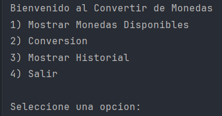
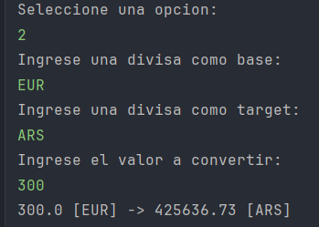
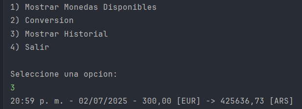

<h1 aling ="center"> Currency Converter </h1>

<h2>Descripcion del Proyecto</h2>

<h4 align="center">
Status del proyecto : Finalizado
  
VERSION 1.0

</h4>

Proyecto en desarrollo para Challenge conversor de Monedas - Alura. Currency Converter es un sistema de divisa para la conversion de distitos tipos de monedas

El sistema permitira a los usuarios tener un historial de las conversiones, soporte a todo tipo de monedas, asi como un registro donde poder ver en que momento se hicieron

## :hammer:Funcionalidades del proyecto

- `Funcionalidad 1`: Conversion de un valor al tipo de moneda deseado
- `Funcionalidad 2`: Historial de conversiones realizadas
- `Funcionalidad 3`: Registro con Marca de Tiempo

<h3>Vamos con la explicacion del Programa: </h3>
<h3>📝 Ejemplo de uso</h3>
Al comienzo de iniciar aparecera el siguiente menu:

A continuación se muestra una conversión de EUR a ARS realizada en el programa:

El historial se guarda en un archivo de texto plano:

 <h3>📄 Licencia</h3>
Este proyecto está bajo la licencia MIT.

<h3>Tecnologias utilizadas</h3>
- Java 20
- Gson
- Exchange
- Vercel

🙋‍♂️ Autor
Juan Pinto - @Pinto05Juan

